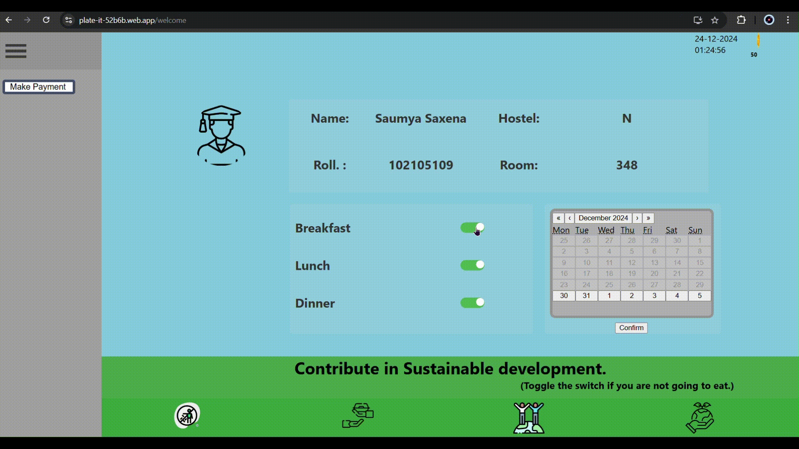

# Zero Waste Kitchen Model

**Zero Waste Kitchen Model** is a capstone project aimed at reducing food wastage in university hostels through a combination of hardware and software solutions. The system ensures efficient meal management using biometric-based mess entry and a web-based meal preference system.

---

## About the Project

This project addresses the significant issue of food wastage in hostel messes, where meals are often prepared for students who don't attend. By integrating a biometric scanner with a web application, students can opt in or out of meals, enabling mess staff to prepare meals based on actual requirements.

---

## Key Components

### Hardware
- **ESP32 Microcontroller**: Acts as the central processing unit, handling communication and biometric data.
- **R307 Fingerprint Scanner**: Captures and verifies fingerprints for mess entry.
- **LED Indicators**: Red and green LEDs provide feedback on entry status.
- **Buzzer**: Alerts students based on entry permissions.

### Software
- **Web Application**: Allows students to update their meal preferences.
- **Firebase Database**: Stores meal preferences and fingerprint data.

---

## Features
1. **Biometric Entry**: Only registered students who opted in for a meal can enter.
2. **Meal Preference Updates**: Students update preferences via a web app.
3. **Reduced Food Wastage**: Meals are prepared based on actual attendance.
4. **Sustainability Focus**: Promotes efficient resource use in hostel mess facilities.

---

## Demo

---

## Team
- **Yog Raj**  
- **Yashika Agarwal**  
- **Saumya Saxena**  
- **Supriya Gupta**

**Mentors**:  
- Dr. Vishal Srivastava, Associate Professor, DEIE
- Dr. Saurabh Bhardwaj, Professor, DEIE

---

## Institution
Department of Electrical & Instrumentation Engineering
Thapar Institute of Engineering & Technology, Patiala (2024)
